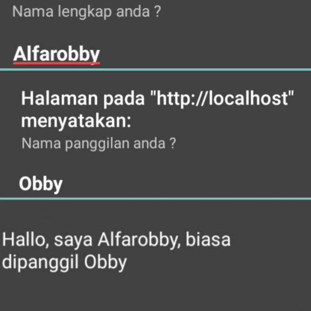

&nbsp;&nbsp;

<h1 align="center"><b>Hi there</b></h1>

<h3 align="center"><b>Hallo, I'm Alfarobby (21 y.o) ! 😎</h3>
	
   

   

	
<h2 align="center"><b>Connect with me</b></h2> 

	
	
	
	
	

   

<h2 align="center">&nbsp;&nbsp;<b>About me</b></h2>

- I'd like to do project that has relation to anime. 👻
- A newbie to programming, but trying to get the hang of it.

   

<h2 align="center">&nbsp;&nbsp;<b>Skills</b></h2>

- **Language**
	
  
  
  

- **Website**

   
   
   
	
- **Software & Tools**

   
   

- **IDE**

   
   
   

   
	
<h2 align="center"><b> GitHub Stats </b></h2>
	

