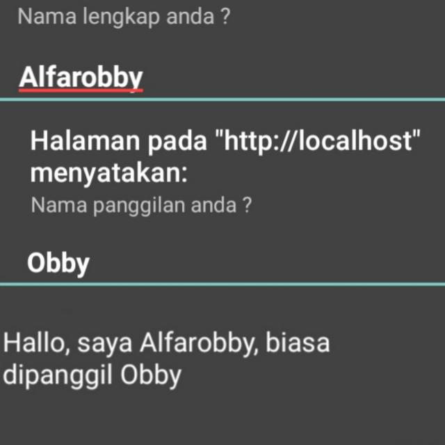
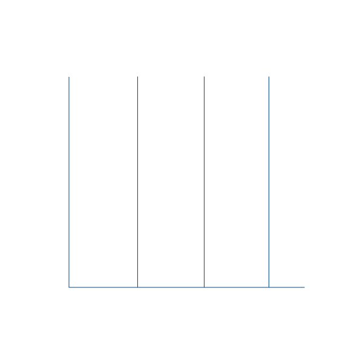

&nbsp;&nbsp;

<h1 align="center"><b>Hi there</b></h1>

<h3 align="center"><b>Hello, I'm Alfarobby! 😎</b></h3>
	
   

   

	
<h2 align="center"><b>Connect with me</b></h2> 

	
	
	

   

<h2 align="center">&nbsp;&nbsp;<b>About me</b></h2>

- Passionate about building projects, especially those inspired by anime and creative concepts. 👻  
- An aspiring developer with hands-on experience in modern web technologies and continuous learning mindset.  
- Familiar with developing full-stack applications using React JS, Flask, and modern frontend tools.  

   

<h2 align="center">&nbsp;&nbsp;<b>Skills</b></h2>

- **Language**
	
  
  
  
  
	
- **Frontend & Web Development**

   
   
   
   
   
   
	
- **Backend & Data**

   
   
   
   
   

- **Tools & Deployment**

   
   
   

- **IDE**

   
   
   

   
	
<h2 align="center"><b> GitHub Stats </b></h2>

 

 

<h2 align="center"><b>📈 Contribution Graph</b></h2>

  

